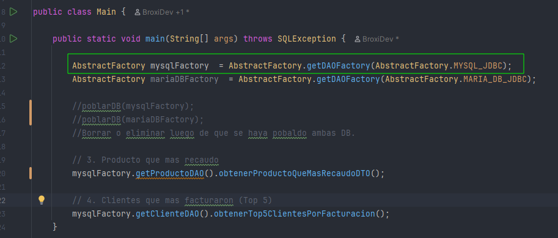

# Integrador 1 — JDBC + MySQL y MariaDB + Docker

## Requisitos
- Java 21
- Maven
- Docker Desktop
---
## Pasos para ejecutar

### 1. Levantar las bases de datos
```bash
 docker-compose up --build -d
 (Una vez que se crean los contenedores, esperar 5 minutos a que se inicialicen las DB. En logs dice algo like "ready for connections")
```

**MySQL**

| Campo      | Valor                                        |
|------------|----------------------------------------------|
| URL        | `jdbc:mysql://localhost:3306/integrador1_db` |
| Usuario    | `root`                                       |
| Contraseña | *(vacía)*                                    |

**MariaDB**

| Campo      | Valor                                           |
|------------|-------------------------------------------------|
| URL        | `jdbc:mariadb://localhost:3307/integrador1_db`  |
| Usuario    | `root`                                          |
| Contraseña | *(vacía)*                                       |

### 2. Poblar la/las DB con datos mock.*
En main.java
- a) Ejecutar `Main.java` con la invocacion a los metodos "poblarDB" para cargar datos de prueba en las bases de datos.
- b) Luego, comentar o borrar las invocaciones a los metodos "poblarDB".


### 3. Seleccionar DB para ejecutar los servicios

- a) Para ejecutar los servicios contra la DB MySQL, utilizar la fabrica mysqlFactory
- b) Para ejecutar los servicios contra la MariaDB, utilizar la fabrica mariaDBFactory

En el siguiente ejemplo, se muestra la invocacion a los servicios utilizando la fabrica mysqlFactory:
