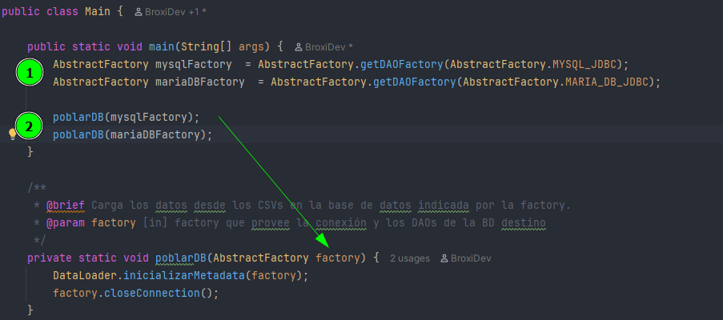

# Integrador 1 — JDBC + MySQL y MariaDB + Docker

## Requisitos
- Java 21
- Maven
- Docker Desktop
---
## Pasos para ejecutar

### 1. Levantar las bases de datos
```bash
 docker-compose up --build -d
```

**MySQL**

| Campo      | Valor                                        |
|------------|----------------------------------------------|
| URL        | `jdbc:mysql://localhost:3306/integrador1_db` |
| Usuario    | `root`                                       |
| Contraseña | *(vacía)*                                    |

**MariaDB**

| Campo      | Valor                                           |
|------------|-------------------------------------------------|
| URL        | `jdbc:mariadb://localhost:3307/integrador1_db`  |
| Usuario    | `root`                                          |
| Contraseña | *(vacía)*                                       |

### 2. Poblar la/las DB con datos mock.*
En main.java


- Para poblar MySQL pasar la instancia de la fabrica al metodo Poblar DB.

- Para poblar MariaDB pasar la instancia de la fabrica al metodo Poblar DB.

- Luego, comentar o borrar la invocacion alos metodos "poblarDB"

### 3. Ejecutar
Correr `Main.java` normalmente con los datos ya cargados.