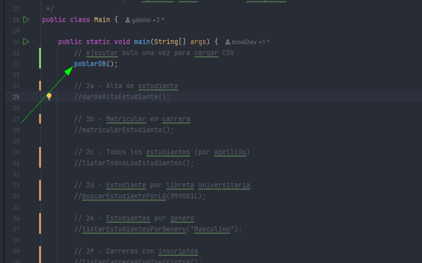
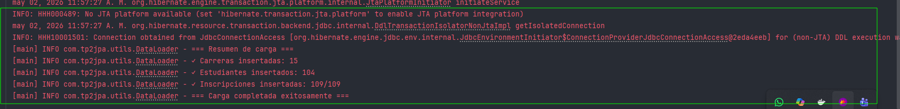

# integrador2

## Setup

### 1. Levantar la base de datos

En el root de del directorio ...\arquitecturas-web\integrador2
```bash
docker-compose up -d
```
Esperá **2-3 minutos** hasta que MySQL esté listo para recibir conexiones.

### 2. Poblar la base (persistir la metadata de los csv)

En `Main.java` ejecutar el servicio.



Si todo salio bien, se verá un log similar a este:


Una vez poblada, volvé a comentar `poblarDB()`.

### 3. Probar los puntos

Descomentá en `Main.java` los métodos que querés ejecutar:

| Método | Punto |
|---|---|
| `darDeAltaEstudiante()` | 2a — Alta de estudiante |
| `matricularEstudiante()` | 2b — Matricular en carrera |
| `listarTodosLosEstudiantes()` | 2c — Todos por apellido |
| `buscarEstudiantePorLU(999001L)` | 2d — Buscar por LU |
| `listarEstudiantesPorGenero("Masculino")` | 2e — Por género |
| `listarCarrerasConInscriptos()` | 2f — Carreras con inscriptos |
| `listarEstudiantesPorCarreraYCiudad(...)` | 2g — Por carrera y ciudad |
| `generarReporteCarreras()` | 3 — Reporte anual |
