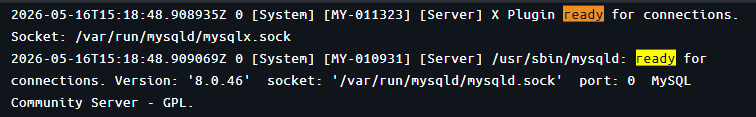

# TP3 — Registro de Estudiantes · Spring Boot REST

## Requisitos
- Java 21
- Maven
- Docker

## Levantar la db
```bash
docker-compose up -d
```
Esperá ~30 segundos a que levante MySQL. Si todo sale bien, verás un mensaje similar a este:


## Ejecutar el servicio
- Si usás un IDE, ejecutá la clase `com.tp2jpa.Main`
- Si usás la terminal, ejecutá en la raíz del proyecto:

```bash
mvn spring-boot:run
```
En la primera ejecución el servicio carga los datos desde los archivos CSV automáticamente. En ejecuciones posteriores se saltará esta etapa si los datos ya existen.

## Swagger UI
Swagger UI: [http://localhost:8001/swagger-ui.html](http://localhost:8001/swagger-ui.html)

## Endpoints

| Método | URL | Descripción |
|--------|-----|-------------|
| GET | `/estudiantes` | Todos los estudiantes (por apellido) |
| GET | `/estudiantes/lu/{lu}` | Por libreta universitaria |
| GET | `/estudiantes/genero/{genero}` | Por género |
| GET | `/estudiantes/carrera/{nombre}?ciudad=X` | Por carrera y ciudad |
| POST | `/estudiantes` | Dar de alta un estudiante |
| POST | `/estudiantes/{dni}/carreras/{idCarrera}` | Matricular en una carrera |
| GET | `/carreras` | Carreras con inscriptos (desc) |
| GET | `/carreras/reporte` | Inscriptos y egresados por año |

```

## Consola MySQL

```bash
docker exec -it arquitecturas_web_container_i3 mysql -u root integrador3_db
```

```sql
SHOW TABLES;
```

## Reset de base de datos

```bash
docker-compose down -v
docker-compose up -d
```
